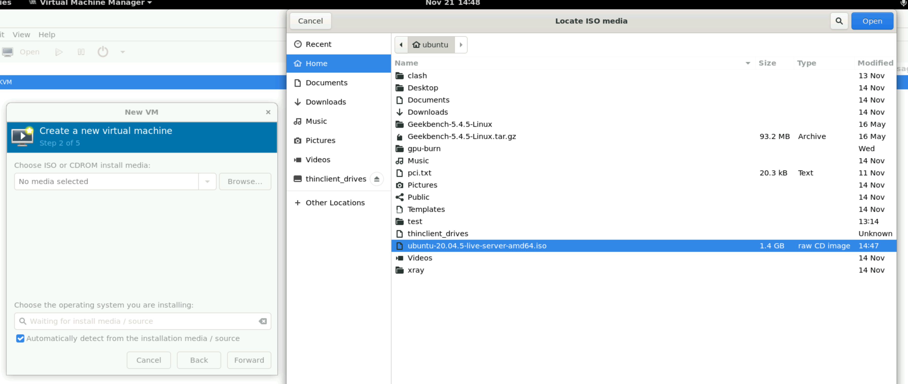

# User Management

## Contents

- [User Management](#user-management)
  - [Contents](#contents)
  - [(Temporary) Setup a KVM virtual machine as a temporary login node](#temporary-setup-a-kvm-virtual-machine-as-a-temporary-login-node)
    - [Install Gnome](#install-gnome)
    - [Install xrdp](#install-xrdp)
    - [Install Virt-Manager, Qemu, libvert and KVM](#install-virt-manager-qemu-libvert-and-kvm)
    - [KVM/Networking](#kvmnetworking)
    - [Post-installation configurations](#post-installation-configurations)
  - [Add New User to the cluster](#add-new-user-to-the-cluster)
  - [Create a Linux account on the login node](#create-a-linux-account-on-the-login-node)
  - [Create a Determined AI account](#create-a-determined-ai-account)
  - [Create TrueNAS NFS share](#create-truenas-nfs-share)
    - [Create new user in TrueNAS](#create-new-user-in-truenas)
    - [Create home dataset for the new user](#create-home-dataset-for-the-new-user)
    - [Create NFS share for the new user](#create-nfs-share-for-the-new-user)
    - [Set up NFS client on every node](#set-up-nfs-client-on-every-node)
  - [Generate user home folder contents](#generate-user-home-folder-contents)
  - [Create and configure a Harbor account](#create-and-configure-a-harbor-account)
  - [References](#references)

## (Temporary) Setup a KVM virtual machine as a temporary login node

If there is no dedicated server as a login node, we need to set up a virtual machine as a login node.

### Install Gnome

First, install a desktop environment (DE) on a bare-metal server. Take Gnome for example:

```bash
sudo apt update && sudo apt install tasksel
```

Then install `ubuntu-minimal-desktop` using `tasksel`

```bash
sudo tasksel
```

Uninstall `unattended-upgrades` according to [First-time Setup: To make the system more reliable](./01_First-time_Setup_of_Cluster_Nodes.md#disable-unattended-updates):

```bash
sudo apt purge unattended-upgrades
```

Also, disable GUI according to [First-time Setup: Disable GUI](./01_First-time_Setup_of_Cluster_Nodes.md#disable-gui):

```bash
sudo systemctl set-default multi-user
```

### Install xrdp

```bash
sudo apt install -y xrdp xorgxrdp
```

You can change the `port=3389` to a safer high port number (e.g. `port=23389`) in `/etc/xrdp/xrdp.ini`.

Add the following lines before `test -x` in `/etc/xrdp/startwm.sh`:

```bash
###############################
# Add these lines
unset DBUS_SESSION_BUS_ADDRESS
unset XDG_RUNTIME_DIR
export GNOME_SHELL_SESSION_MODE=ubuntu
export XDG_CURRENT_DESKTOP=ubuntu:GNOME
###############################
test -x /etc/X11/Xsession && exec /etc/X11/Xsession
exec /bin/sh /etc/X11/Xsession
```

Create `/etc/polkit-1/localauthority/50-local.d/45-allow-colord.pkla` with the following contents:

```conf
[Allow Colord all Users]
Identity=unix-user:*
Action=org.freedesktop.color-manager.create-device;org.freedesktop.color-manager.create-profile;org.freedesktop.color-manager.delete-device;org.freedesktop.color-manager.delete-profile;org.freedesktop.color-manager.modify-device;org.freedesktop.color-manager.modify-profile
ResultAny=no
ResultInactive=no
ResultActive=yes
```

Restart the service

```bash
sudo systemctl restart xrdp
```

Now you can connect to the `xrdp` remote desktop with `MSTSC.exe` (Windows) or `Remmina` (Unix).


### Install Virt-Manager, Qemu, libvert and KVM

```bash
sudo apt-get install virt-manager cpu-checker \
    qemu-kvm libvirt-daemon-system libvirt-clients bridge-utils
```

Check if KVM can be used:

```bash
kvm-ok
```

Continue when it says

```text
INFO: /dev/kvm exists
KVM acceleration can be used
```

User, Group and Permission

```bash
sudo adduser `id -un` libvirt
sudo adduser `id -un` kvm
```

Run virt-manager (GUI application) with the `xrdp` remote desktop

```bash
newgrp libvirt # needed before reboot
virt-manager
```

Then continue to create a virtual machine as a login node.





### KVM/Networking

The default virtual network configuration is NAT (Ref: [Ubuntu docs](https://help.ubuntu.com/community/KVM/Networking)).

In the default configuration, the guest operating system will have access to network services, but will not be visible to other machines on the network. The guest will be able, for example, to browse the web, but will not be able to host an accessible web server.

By default, the guest OS will get an IP address in the 192.168.122.0/24 address space and the host OS will be reachable at 192.168.122.1.

You should be able to ssh into the host OS (at 192.168.122.1) from inside the guest OS and use `scp` to copy files back and forth.

As an alternative to the default NAT connection, you can use the `macvtap` driver to attach the guest's NIC directly to a specified physical interface of the host machine (Ref: [Redhat docs](https://access.redhat.com/documentation/en-us/red_hat_enterprise_linux/7/html/virtualization_deployment_and_administration_guide/sect-virtual_networking-directly_attaching_to_physical_interface)). This is necessary for our virtual login-node setup.

We create two virtual NICs that *use `macvtap` driver in bridge mode* to enable the guest VM to connect directly to the campus network and the 10GbE private network, which is the same as a dedicated login node.

Note that the two host NIC here (`eno1` and `ens114f1`) must be the same NIC that the host server uses to connect to the networks.


Also notice that when using `macvtap`, the host cannot communicate with the guest. Thus, we need to create another NAT NIC:


With these three NICs configured, we proceed with the installation.


Finally, we configure the virtual networks in the virtual machine's `netplan`.

For example, the host has these NICs and corresponding IPs:

|  Device  |        IP      |
| :------: | :------------: |
|   eno1   |    10.0.1.67   |
| ens114f0 | 192.168.233.7  |
|  virbr0  | 192.168.122.1  |

We assign these IPs to the guest's virtual NICs:

|  Device                   |        IP      |
| :------:                  | :------------: |
| enp1s0 (eno1-macvtap)     |    10.0.1.67   |
| enp2s0 (ens114f0-macvtap) | 192.168.233.7  |
| enp3s0 (NAT)              | 192.168.122.7  |


As a result, users in the campus network can use IP `10.0.1.67` to connect to the login node;

The host server can connect to it using IP `192.168.122.7`;

Other servers can connect to it using IP `192.168.233.7` (or the slower 1GbE `10.0.1.67`).

### Post-installation configurations

1) NFS mount

    We also need to add the NFS shares to `/etc/fstab`, as we [did on the GPU nodes](./03_Setup_DeterminedAI.md#scale-to-multi-node-configure-nfs-export--nfs-client).

2) Environment variables

    We should set the `DET_MASTER` for Determined AI's master node, so that the users won't need to set it by themselves. Append this line to `/etc/environment`:

    ```sh
    DET_MASTER="192.168.233.66"
    ```


## Add New User to the cluster

```text
┌─────────────────────────────────────────────────────────────────┐
│               Create Linux account on login node                │
│                               │                                 │
│                               ▼                                 │
│                       Check UID and GID                         │
│                               │                                 │
│              ┌────────────────┴─────────────────┐               │
│              ▼                                  ▼               │
│ Create Determined AI account        Create TrueNAS NFS share    │
│              │                                  │               │
│              ▼                                  ▼               │
│   det link-with-agent-user       Mount NFS share on every node  │
└─────────────────────────────────────────────────────────────────┘
```

## Create a Linux account on the login node

First, create a Linux account for the new user on the login node:

```bash
export USERNAME=<username> # Change to new user's name
sudo useradd $USERNAME -s /usr/bin/bash
sudo passwd $USERNAME
```

Add docker permission:

```bash
sudo usermod -aG docker $USERNAME
```

Then check out the `UID` and `GID` in `/etc/passwd`, which will be useful in the next section:

```bash
id $USERNAME
```

For example, the output is:

```bash
uid=1014(wanpian) gid=1014(wanpian) groups=1014(wanpian)
```

Then the user's `UID` and `GID` are both `1014`. Set env var for the next section:

```bash
export USERID=1014
```

## Create a Determined AI account

```bash
det user create $USERNAME
det user change-password $USERNAME # Or the user can change password on the web dashboard
det user link-with-agent-user $USERNAME --agent-uid $USERID --agent-user $USERNAME --agent-gid $USERID --agent-group $USERNAME
det user edit $USERNAME --display-name "USER FULLNAME"
```

Check the result with:

```bash
det user list
```

## Create TrueNAS NFS share

### Create new user in TrueNAS

1. Add new group. Go to Credentials -> Groups [(this url)](http://10.0.1.70/ui/credentials/groups), type in `GID` and `Name`, then click **Save**:

   

2. Add new user. Go to Credentials -> Users [(this url)](http://10.0.1.70/ui/credentials/users), **type in** `UID`, `Full Name`, AND THEN `Username` (NOTICE the step order here since it will generate a default username accorading to the given full name), **select** `Disable Password`, **UNselect** `Create New Primary Group`, **type in** the new group that we just created into `Primary Group`, **Unselect**, `Samba Authentication`, then click **Save**:

   

### Create home dataset for the new user

In the previous section, we have configured a **Dataset** `home`
that will be used to store user files.
Now we need to create NFS share for every user separately.

1. Open the TrueNAS web dashboard. In **Datasets->HDD->home**,
   navigate to the Dataset `HDD/home` (or you can directly [click this url](http://10.0.1.70/ui/datasets/HDD%2Fhome/)),
   then click **Add Dataset** to add a sub-dataset of it, type in the same username into `Name`. Then take a breath for the `Advanced Options`:

   

   (Ignore the warning since the dataset has already been created in this example)

2. In the same page, click **Advanced Options**, in **This Dataset**, let `Quota for this dataset = 4TiB`.

   

3. Click **Save** at the bottom to commit these changes.

4. Click the newly create sub-dataset,
   and select **Edit** Permissions.
   On the new **Unix Permissions Editor** page, click **Set ACL**,
   then in the new **Select a preset ACL** pop-up window, select **NFS4_HOME** as the preset ACL.
   On the new **Edit ACL** page, search and select the `User` and `Group` to those we just created. Also, enable the `Apply Owner` and `Apply Group` options to take effect.
   

5. Click **Save Access Control List** at the bottom to commit these changes.

### Create NFS share for the new user

1. Go to `Shares/UNIX (NFS) Shares` (or directly [click this link](http://10.0.1.70/ui/sharing/nfs)), then click **Add**, and select the sub-dataset just created above.
2. In **Networks**, Click **Add** and type in `[192.168.233.0/24, 10.0.1.64/27]`.
3. Click **Save** at the bottom of the page.

   

### Set up NFS client on every node

1. Install NFS client

   ```bash
   sudo apt install nfs-common
   ```

2. Set up hosts

   On the login node:

   Append this line to `/etc/hosts`:

   ```text
   192.168.233.234 nas.cvgl.lab
   ```

   While on EVERY GPU (agent) node:

   Append this line to `/etc/hosts`:

   ```text
   192.168.233.233 nas.cvgl.lab
   ```

3. Set up `fstab`

   On the login node *as well as* EVERY GPU (agent) node:

   First, create the mount point for the new user

   ```bash
   sudo mkdir /workspace/<username>
   ```

   Edit the file `/etc/fstab`, add this new line for the new user

   ```text
   nas.cvgl.lab:/mnt/Peter/Workspace/<username> /workspace/<username> nfs defaults,noatime,hard,nointr,rsize=32768,wsize=32768,_netdev 0 2
   ```

   To take effect, execute

   ```bash
   sudo mount -a
   ```

   Check if the configuration is successful, execute

   ```bash
   df -H
   ```

   If the output shows:

   ```text
   nas.cvgl.lab:/mnt/Peter/Workspace/<username>        8.8T   99k  8.8T   1% /workspace/<username>
   ```

   then the configuration is a success.

## Generate user home folder contents

The user's home folder is empty now and we need to generate the default contents for them. After finishing the steps above, on the login node:

```bash
sudo -u $USERNAME chsh -s /bin/bash
sudo -u $USERNAME xdg-user-dirs-update --force
sudo -u $USERNAME cp /etc/skel/.* /home/$USERNAME
```

> Note: You will be prompted to input the user's default password.
>
> Ref: https://askubuntu.com/questions/152707/how-to-make-user-home-folder-after-account-creation

## Create and configure a Harbor account

1. Add a new user in **Administration -> Users -> NEW USER** (URL: https://harbor.cvgl.lab/harbor/users)

    

2. Add the new user to the maintainers of the public library, in **Projects -> libaray -> Members** (URL: https://harbor.cvgl.lab/harbor/projects/1/members)

    

## References

1. Linux

   - [How to Create Users and Groups in Linux from the Command Line](https://www.techrepublic.com/article/how-to-create-users-and-groups-in-linux-from-the-command-line/)
   - [How to Change Directory Permissions in Linux with `chmod`](https://www.pluralsight.com/blog/it-ops/linux-file-permissions)
   - [How To Set or Change Linux User Password](https://www.cyberciti.biz/faq/linux-set-change-password-how-to/)

2. Determined AI

   - [How to Create Users and Change Password](https://docs.determined.ai/latest/cluster-setup-guide/users.html)
   - [Run Tasks as Specific Agent Users](https://docs.determined.ai/latest/cluster-setup-guide/users.html?highlight=det%20user)

3. NFS and ACLs

   - [Introduce Parameters of Configuration File `/etc/exports` on NFS Server](https://blog.csdn.net/weixin_34346099/article/details/89793704)

4. Other services

   - [Harbor Administration](https://goharbor.io/docs/2.1.0/administration/)
