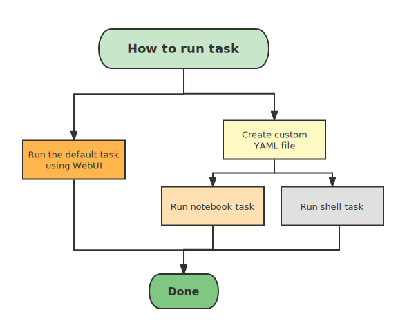
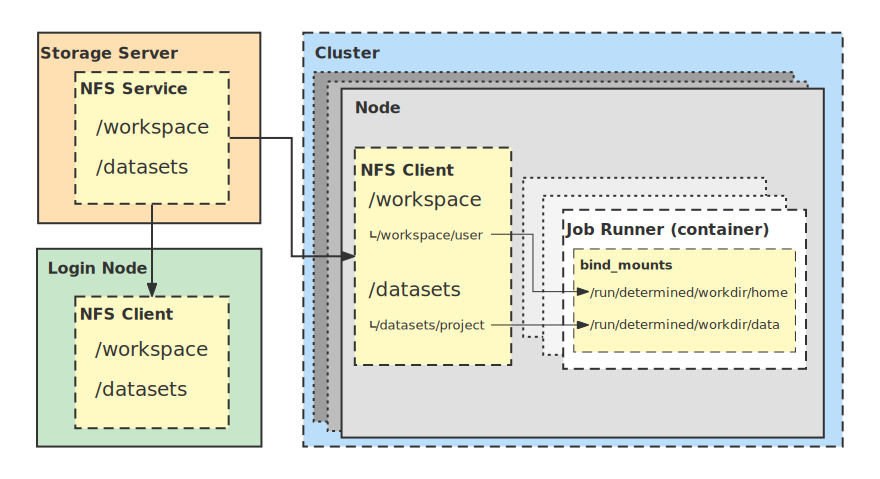

# Setup DeterminedAI

## Contents

- [Setup DeterminedAI](#setup-determinedai)
  - [Contents](#contents)
  - [Deploy a Determined AI Single-Node Cluster](#deploy-a-determined-ai-single-node-cluster)
  - [Scale to multi-node: configure NFS export \& NFS client](#scale-to-multi-node-configure-nfs-export--nfs-client)
  - [Scale to multi-node: configure Determined AI](#scale-to-multi-node-configure-determined-ai)
  - [Conduct an experiment with `Determined AI`](#conduct-an-experiment-with-determined-ai)
    - [`ssh` to a remote server](#ssh-to-a-remote-server)
    - [Log in `Determined AI`](#log-in-determined-ai)
    - [Upload code and data to the server](#upload-code-and-data-to-the-server)
    - [Configure your virtual environment](#configure-your-virtual-environment)

## Deploy a Determined AI Single-Node Cluster

Introduction

> https://docs.determined.ai/latest/introduction.html

Basic setup

> https://docs.determined.ai/latest/cluster-setup-guide/basic.html

Deploy a single node cluster

> https://docs.determined.ai/latest/cluster-setup-guide/deploy-cluster/sysadmin-deploy-on-prem/deploy.html#deploy-a-single-node-cluster

After a successful deployment, you can test the task submiting workflow:



Interactive jupyter notebook task

> https://docs.determined.ai/latest/interfaces/notebooks.html
> https://docs.determined.ai/latest/reference/reference-interface/job-config-reference.html

Shell task for VSCode and PyCharm, etc.

> https://docs.determined.ai/latest/interfaces/commands-and-shells.html

## Scale to multi-node: configure NFS export & NFS client

The storage model:



(Temporary) Example of NFS configuration:

```sh
# On Node01 as NFS server
sudo su
apt install nfs-kernel-server
systemctl enable nfs-kernel-server --now
vim /etc/exports
################################################
/data   192.168.123.0/24(rw,sync,no_subtree_check,no_root_squash)
#################################################
exportfs -ar

mkdir -p /shared-data
echo "/data /shared-data nfs defaults,noatime,hard,nointr,rsize=32768,wsize=32768,_netdev 0 2" >> /etc/fstab
mount -a

# On Node02 as NFS client
sudo su
apt install nfs-common
mkdir -p /shared-data
echo "192.168.123.162:/data /shared-data nfs defaults,noatime,hard,nointr,rsize=32768,wsize=32768,_netdev 0 2" >> /etc/fstab
mount -a
```

Notes:

1) In the server configuration, we did not expose our NFS service to the campus network (`10.0.2.160/27`) to comply with security rules.
We only expose the NFS service to the private 10GbE network `192.168.123.0/24`.
2) In the client configuration, `192.168.123.162` is the IP of the `NFS Server`.
You can first check the availability of the NFS service on the client using the command `showmount -e 192.168.123.162`.

## Scale to multi-node: configure Determined AI

> https://docs.determined.ai/latest/cluster-setup-guide/deploy-cluster/sysadmin-deploy-on-prem/deploy.html#deploy-a-standalone-master

## Conduct an experiment with `Determined AI`

`Determined AI` provides a solution for creating a virtual environment with some computing resources (e.g., GPUs, memory, and CPUs).

### `ssh` to a remote server

```sh
ssh user_name@host_name
```

then, input `password` to complete `ssh`. You can ask sp12138sp@gmail.com for the `user_name`, `host_name` and `password`.

### Log in `Determined AI`

```sh
det user login user_name
```

then, input `password` to log in.

### Upload code and data to the server

Upload your code and data to a path `/labdata0/xxx/` on the server, where `/xxx/` is a directory created by you.

### Configure your virtual environment

Write a configuration document `config.yaml` under the path `/labdata0/xxx/`, in which:

```yaml
description: your_task_name
resources:
    slots: number_of_GPUs
bind_mounts:
  - host_path: /labdata0/xxx/
    container_path: /run/determined/workdir/xxx/
environment:
    image: determinedai/environments:cuda-11.3-pytorch-1.10-tf-2.8-gpu-0.19.4
```

These parameters configure the virtual environment, where

- `description`: Tag your task.
- `resources`: The number of GPUs (i.e., `slots`) used to run the task.
- `bind_mounts`: Mount your data and code into the docker container. `host_path` is the path of the physical machine, `container_path` is the path inside the container.
- `environment`: The environment configuration of the docker container, in which `image` is `docker-image` that you uses.

Above all, start the virtual environment:

```sh
det shell start --config-file config.yaml
```

Then, `cd` to `/run/determined/workdir/xxx/` inside the container and run your code.
