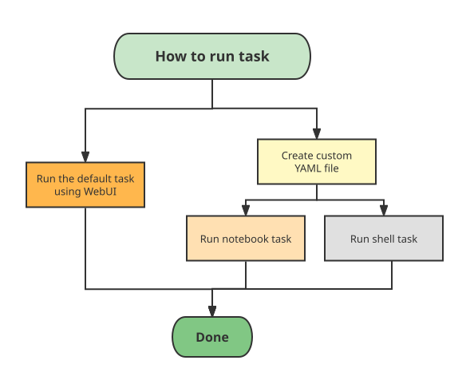
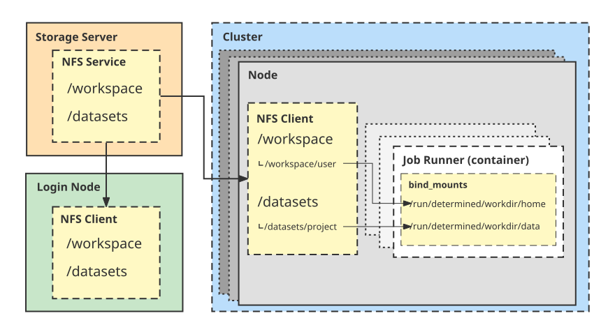

# Setup DeterminedAI

## Contents

- [Setup DeterminedAI](#setup-determinedai)
  - [Contents](#contents)
  - [Deploy a Determined AI Single-Node Cluster](#deploy-a-determined-ai-single-node-cluster)
  - [Scale to multi-node: configure NFS export \& NFS client](#scale-to-multi-node-configure-nfs-export--nfs-client)
    - [NFS client mount options](#nfs-client-mount-options)
  - [Scale to multi-node: configure Determined AI](#scale-to-multi-node-configure-determined-ai)
  - [TL;DR](#tldr)
    - [Installation](#installation)
    - [Launch master \& agents](#launch-master--agents)
  - [Conduct an experiment with `Determined AI`](#conduct-an-experiment-with-determined-ai)
    - [`ssh` to a remote server](#ssh-to-a-remote-server)
    - [Log in `Determined AI`](#log-in-determined-ai)
    - [Upload code and data to the server](#upload-code-and-data-to-the-server)
    - [Configure your virtual environment](#configure-your-virtual-environment)
  - [Maintainance](#maintainance)
    - [Upgrade Determined](#upgrade-determined)
    - [Add a resource pool](#add-a-resource-pool)
    - [Task resource monitoring](#task-resource-monitoring)

The cluster runs our fork of Determined, [WU-CVGL/determined](https://github.com/WU-CVGL/determined) (version `0.41.0`): the `det` CLI, the master image `ghcr.io/wu-cvgl/determined-master` and the agent image `ghcr.io/wu-cvgl/determined-agent` all come from its releases. The upstream documentation linked below still describes the concepts and the configuration.

## Deploy a Determined AI Single-Node Cluster

Introduction

> https://docs.determined.ai/latest/introduction.html

Basic setup

> https://docs.determined.ai/latest/cluster-setup-guide/basic.html

Deploy a single node cluster

> https://docs.determined.ai/latest/cluster-setup-guide/deploy-cluster/sysadmin-deploy-on-prem/deploy.html#deploy-a-single-node-cluster

After a successful deployment, you can test the task submiting workflow:



Interactive jupyter notebook task

> https://docs.determined.ai/latest/interfaces/notebooks.html
> https://docs.determined.ai/latest/reference/reference-interface/job-config-reference.html

Shell task for VSCode and PyCharm, etc.

> https://docs.determined.ai/latest/interfaces/commands-and-shells.html

## Scale to multi-node: configure NFS export & NFS client

The storage model:



(Temporary) Example of NFS configuration:

```sh
# On Node01 as NFS server
sudo su
apt install nfs-kernel-server
systemctl enable nfs-kernel-server --now
vim /etc/exports
################################################
/data   192.168.233.0/24(rw,sync,no_subtree_check,no_root_squash)
#################################################
exportfs -ar

mkdir -p /shared-data
echo "/data /shared-data nfs defaults,noatime,hard,nointr,rsize=32768,wsize=32768,_netdev 0 2" >> /etc/fstab
mount -a

# On Node02 as NFS client
sudo su
apt install nfs-common
mkdir -p /shared-data
echo "192.168.233.162:/data /shared-data nfs defaults,vers=3,noatime,hard,nconnect=16,rsize=1048576,wsize=1048576,_netdev 0 2" >> /etc/fstab
mount -a
```

Notes:

1) In the server configuration, we did not expose our NFS service to the campus network (`10.0.1.64/27`) to comply with security rules.
We only expose the NFS service to the private network `192.168.233.0/24` (100GbE on the GPU nodes).
2) In the client configuration, `192.168.233.233` is the IP of the `NFS Server`.
You can first check the availability of the NFS service on the client using the command `showmount -e 192.168.233.233`.

### NFS client mount options

Every NFS mount on the nodes uses the same options, set by `scripts/create_user.py` for new users and by `scripts/nfs-remount.sh` for existing entries:

```text
defaults,vers=3,noatime,hard,nconnect=16,rsize=1048576,wsize=1048576,_netdev
```

| Option | Why |
| :--- | :--- |
| `rsize=1048576,wsize=1048576` | 32 KiB reads and writes cap a mount at about 1 GB/s; 1 MiB reaches about 2.5 GB/s per TCP connection. |
| `nconnect=16` | One TCP connection stops at about 2.5-2.7 GB/s; 16 connections reach the 100GbE line rate for reads. |
| `hard` | A NAS outage stalls I/O until the NAS is back instead of returning errors; `soft` can lose writes silently after a timeout. |
| `vers=3` | Same semantics as before (numeric IDs, no NFSv4 ID mapping or leases); NFSv4.2 measured only 5-10 % faster without `nconnect`. |

`nconnect` applies per NFS server, not per mount: all mounts of one server on a node share the TCP connections set up by the first of them that is mounted. A mix of options on one node therefore leaves `nconnect` unused. Check it in `/proc/self/mountstats`: the section of each mount lists one `xprt:` line per connection, 16 with `nconnect=16` (`ss` shows fewer, connections open on demand).

Measured from one GPU node (`fio`, direct I/O, 4 jobs, 1 MiB sequential and 4 KiB random reads, files on the SSD pools; reads of just-written files come largely from the NAS's RAM cache, so they show the network and protocol limit, not the disks):

| Mount options | Sequential write (GB/s) | Sequential read (GB/s) | 4 KiB random read (IOPS) |
| :--- | ---: | ---: | ---: |
| 32 KiB, `soft` | 0.74-0.86 | 0.84-0.99 | 29k-46k |
| 1 MiB, `hard` | 1.61-2.61 | 2.35-2.64 | 28k-46k |
| 1 MiB, `hard`, `nconnect=16` | 1.47-6.14 | 10.5-12.3 | 115k-118k |

Writes are limited by the NAS: ZFS pools above about 80-90 % full write much slower, so keep the pools below that.

Applying the options to a node's existing mounts: disable and drain the node in Determined (`det agent disable --drain <agent>`), wait until no task runs on it, then:

```bash
sudo scripts/nfs-remount.sh --dry-run   # fstab changes, mounts per NAS, busy mounts
sudo scripts/nfs-remount.sh             # rewrites fstab (backup in /etc/fstab.nfs-remount-*), remounts per NAS
det agent enable <agent>
```

The script refuses while Determined task containers run. It remounts all mounts of a NAS together and skips a NAS whose mounts are in use (open files or a working directory; listed with the process IDs), so nothing is killed. Rerun it once those processes are gone, or reboot: the fstab is already rewritten. It ends with one line per NAS: mounts remounted, options applied, number of transports.

On a node that is rarely idle (long-running tasks, interactive sessions on the login node), `sudo scripts/nfs-remount.sh --remount-later` rewrites the fstab only and leaves the mounts alone, also while tasks run; the options take effect at the next reboot or a later run without the flag. A single mount remounted before that gets 1 MiB and `hard` but joins the existing connections of its NAS, so `nconnect` waits until all mounts of that NAS are mounted again.

## Scale to multi-node: configure Determined AI

> https://docs.determined.ai/latest/cluster-setup-guide/deploy-cluster/sysadmin-deploy-on-prem/deploy.html#deploy-a-standalone-master

## TL;DR

### Installation

Install the CLI of our fork, in the version of the master (`0.41.0`); see [Install Determined AI Systemwide](./01_First-time_Setup_of_Cluster_Nodes.md#install-determined-ai-systemwide) for the nodes:

```bash
pip install -U "https://github.com/WU-CVGL/determined/releases/download/0.41.0/determined-0.41.0-py3-none-any.whl"
```

Not `pip install determined`: that is the upstream package.

### Launch master & agents

The master and the agents run as Docker containers started with `docker run`, not with `det deploy local`: see the [notes](../services/determined/README.md) ([Master](../services/determined/README.md#master), [Agents](../services/determined/README.md#agents)) and the [master configuration file](../services/system-configurations/etc/determined/master.yaml).

## Conduct an experiment with `Determined AI`

`Determined AI` provides a solution for creating a virtual environment with some computing resources (e.g., GPUs, memory, and CPUs).

### `ssh` to a remote server

```sh
ssh user_name@host_name
```

then, input `password` to complete `ssh`. You can ask the system admin for the `user_name`, `host_name` and `password`.

### Log in `Determined AI`

```sh
det user login user_name
```

then, input `password` to log in.

To change your own password or username, the master asks for your current password. Use the WebUI or the CLI of the master's version (`det user change-password`, see [Installation](#installation)); a CLI of version 0.40.1 or older cannot do it.

### Upload code and data to the server

Upload your code and data to a path `/workspace/xxx/` on the server, where `xxx` is your username (your NFS workspace).

### Configure your virtual environment

Write a configuration document `config.yaml` under the path `/workspace/xxx/`, in which:

```yaml
description: your_task_name
resources:
    slots: number_of_GPUs
bind_mounts:
  - host_path: /workspace/xxx/
    container_path: /run/determined/workdir/xxx/
environment:
    image: determinedai/environments:cuda-11.3-pytorch-1.10-tf-2.8-gpu-0.19.4
```

These parameters configure the virtual environment, where

- `description`: Tag your task.
- `resources`: The number of GPUs (i.e., `slots`) used to run the task.
- `bind_mounts`: Mount your data and code into the docker container. `host_path` is the path of the physical machine, `container_path` is the path inside the container.
- `environment`: The environment configuration of the docker container, in which `image` is `docker-image` that you uses.

Above all, start the virtual environment:

```sh
det shell start --config-file config.yaml
```

Then, `cd` to `/run/determined/workdir/xxx/` inside the container and run your code.

The WebUI can also launch a shell or a JupyterLab with the same configuration, and opens the shell's terminal in the browser.

## Maintainance

See [Maintainance: Upgrade APT packages & `Determined AI`](./01_First-time_Setup_of_Cluster_Nodes.md#maintainance-upgrade-apt-packages--determined-ai).

### Upgrade Determined

Upgrade to a [release of our fork](https://github.com/WU-CVGL/determined/releases), following its [installation and deployment guide](https://github.com/WU-CVGL/determined/blob/main/docs/maintenance/distribution.md). Keep the CLI, the master and all agents on the same version; during a rolling agent upgrade, mixed versions work.

When the release allows a hot upgrade (see the fork's [hot upgrade guide](https://github.com/WU-CVGL/determined/blob/main/docs/maintenance/hot-upgrade.md)), running tasks continue. In short (commands in the [notes](../services/determined/README.md#upgrade)):

1. Install the new CLI (see [Installation](#installation)) and pull the new images on the master node and on every agent node.
2. Back up the PostgreSQL database.
3. Stop the old master container, keep it for a rollback, and start the new one from a new deploy directory. Check that the database migration finished and that you can log in. Keep the master outage well under ten minutes: tasks that write output are killed after about 11 minutes without a master.
4. Replace the agent containers one node at a time, with the same GPUs and pool, so that they reattach the running tasks.
5. Check tasks, metrics and checkpoints.

Otherwise upgrade cold: disable the agents first (`det agent disable --all --drain` lets the running tasks finish, plain `det agent disable --all` stops them now; announce either), back up the database once nothing runs, replace the master and the agents as above, and enable the agents again (`det agent enable --all`).

Rollback: when the previous master starts against the migrated database, stop the new master container and start the old one again; the [notes](../services/determined/README.md#rollback) list the preconditions. Otherwise stop the agents and the master, restore the database backup, and start the previous version again. Switching back to the old images alone does not undo the database migration.

### Add a resource pool

Add pools at runtime as dynamic pools of our fork ([guide](https://github.com/WU-CVGL/determined/blob/main/docs/maintenance/dynamic-pools.md)); every pool of the cluster is one. Never add a pool to `master.yaml` (the master would refuse to start when a pool there has the name of a dynamic pool). A dynamic pool cannot be renamed or deleted, so choose its name carefully; `det resource-pool update` changes its settings later (see [Dynamic resource pools](../services/determined/README.md#dynamic-resource-pools)).

1. Write the pool as its own file in [`services/determined/resource-pools/`](../services/determined/resource-pools/) (the pool object itself, not a `resource_pools:` list). Use the settings of the other pools there (`agent_reconnect_wait: 10m`). A pool without its own `scheduler` or `task_container_defaults` uses those of `master.yaml`, also after later changes there (from the next master restart).
2. As an administrator, create it with a fixed idempotency key (safe to repeat with the same file and key), and check that it becomes `Ready`:

    ```bash
    det resource-pool create <pool>.yaml --idempotency-key create-<pool>-<date>
    det resource-pool list-dynamic      # Pending -> Ready; Failed shows the error
    ```

    `--cluster-name` is not needed: the cluster has a single agent resource manager. If it ends `Failed`, fix the cause and run `det resource-pool retry <pool>` (it reuses the saved configuration, not the file).
3. Start the agents of the pool with `DET_RESOURCE_POOL=<pool>` (see [Agents](../services/determined/README.md#agents)). Creating a pool does not move agents; move a busy agent only after disabling it with `--drain` and waiting for its tasks.
4. Check it with a small task: `det command run --config resources.resource_pool=<pool> --config resources.slots=1 nvidia-smi`.

Warning: Do not upgrade when the cluster is in use! Upgrading packages especially those related to the kernel, DKMS, GPU drivers and containers will kill running tasks.

### Task resource monitoring

The WebUI's **Resources** pages (**View Resources** in the task and experiment menus) and the API `GET /api/v1/tasks/{task_id}/resources` show a task's CPU, memory and GPU use. The master reads them from the Prometheus of the supplementary services, as set by `integrations.task_resources` in the [master configuration file](../services/system-configurations/etc/determined/master.yaml). What the master and Prometheus must agree on, how to check the chain and what to look at when the charts stay empty: [Determined task resources](../services/prometheus/README.md).
