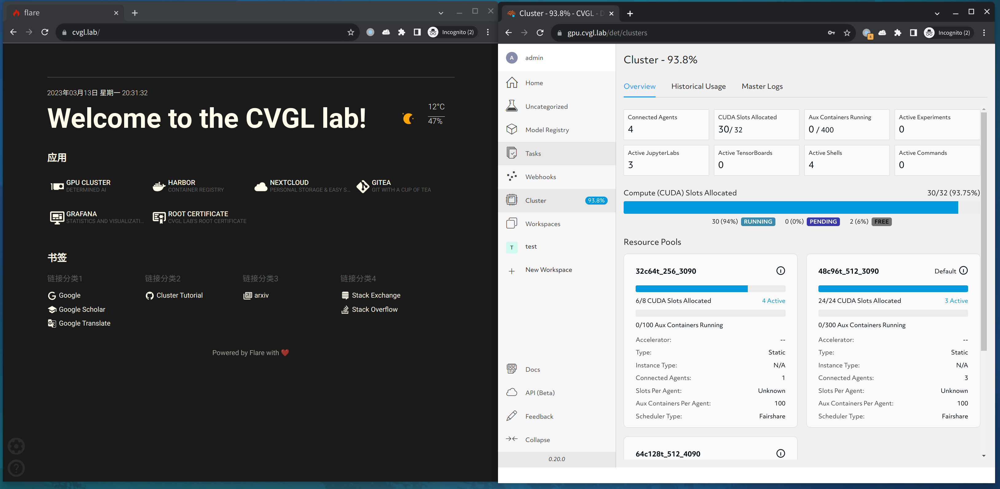
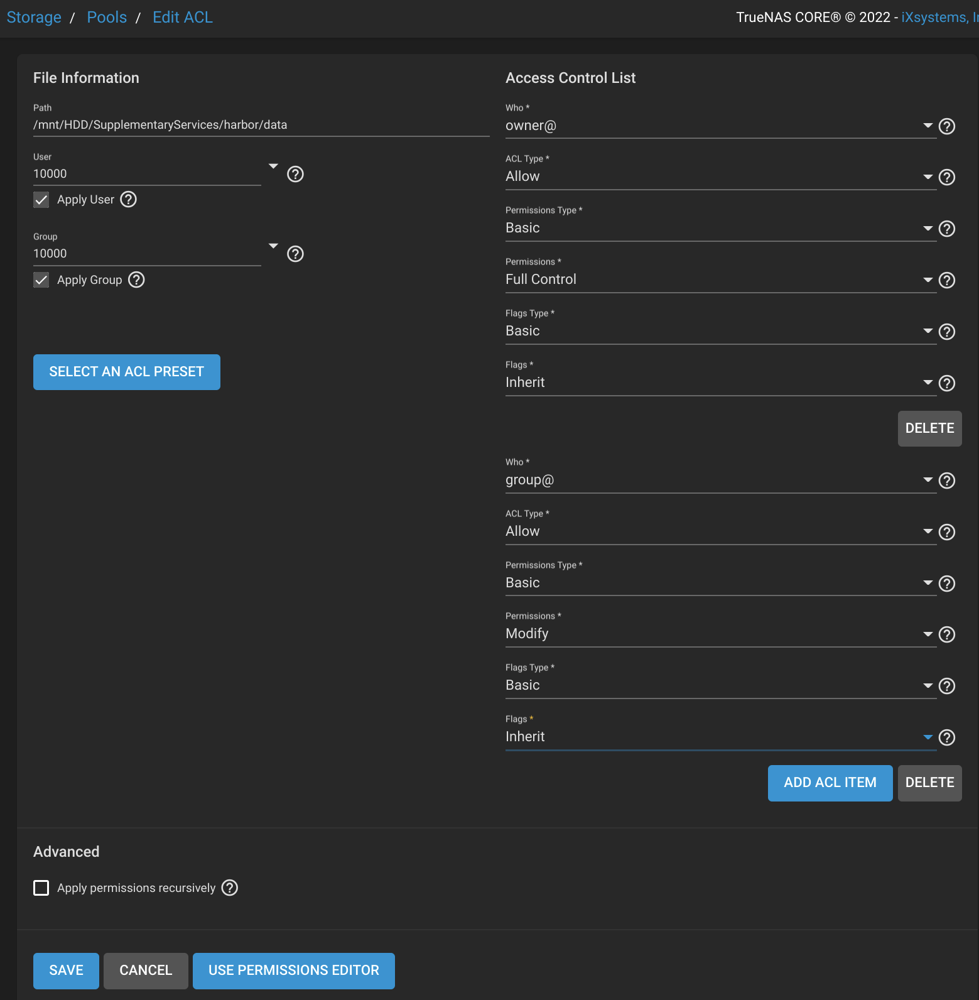
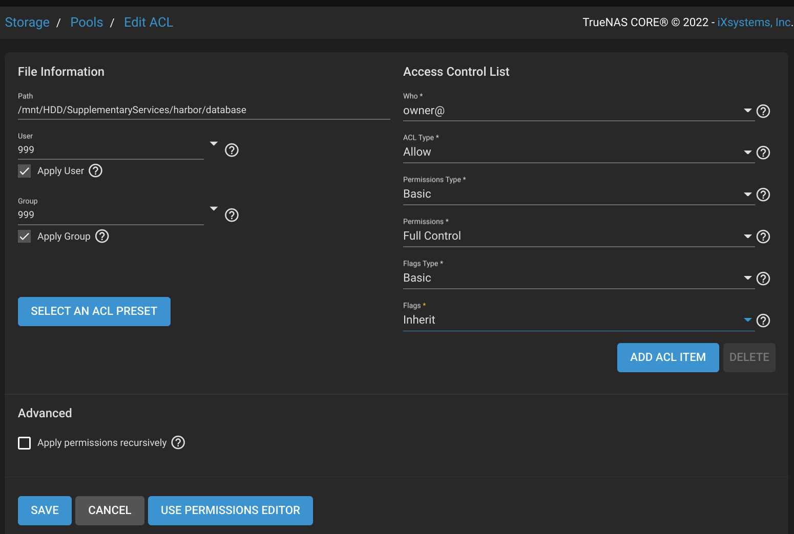
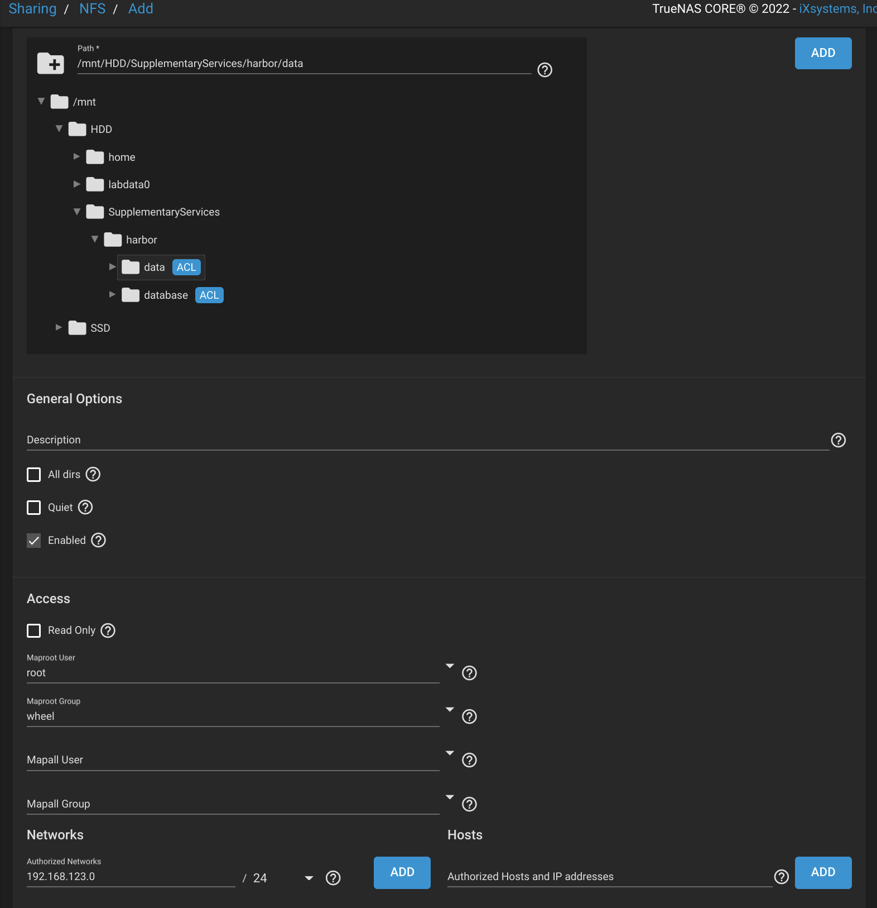
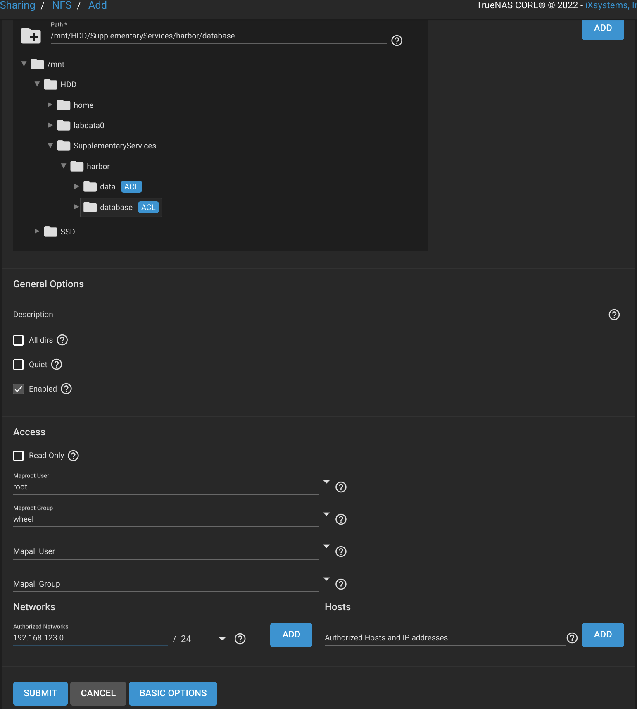
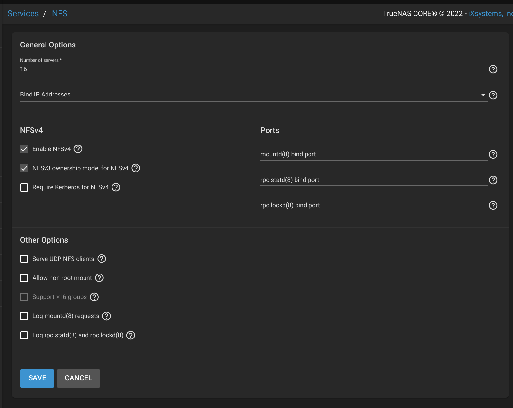
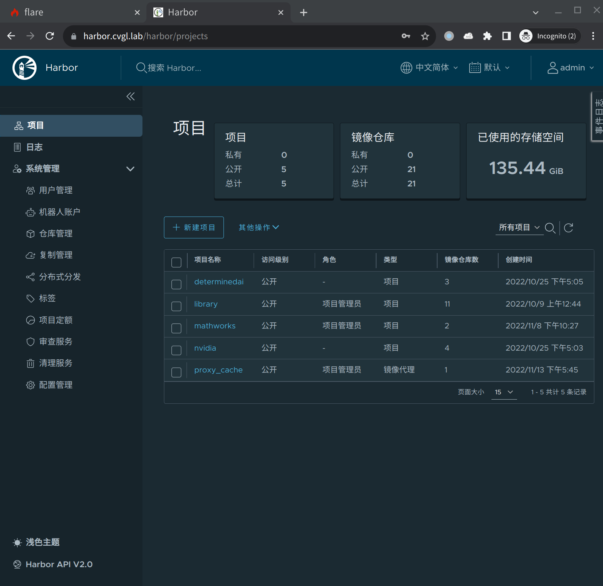

# Setup Supplementary Services

## Contents

- [Setup Supplementary Services](#setup-supplementary-services)
  - [Contents](#contents)
  - [Introduction](#introduction)
  - [Proxy as a service](#proxy-as-a-service)
  - [Configure proxy service on the login node](#configure-proxy-service-on-the-login-node)
      - [Proxychains](#proxychains)
      - [Environment variable](#environment-variable)
  - [SSL, HTTPS and reverse proxy](#ssl-https-and-reverse-proxy)
    - [Background knowledge](#background-knowledge)
    - [Create an SSL certificate](#create-an-ssl-certificate)
    - [Configure NGINX](#configure-nginx)
  - [All-in-one](#all-in-one)
  - [Harbor](#harbor)
    - [Install Harbor on the supplementary services node](#install-harbor-on-the-supplementary-services-node)
      - [Steps](#steps)
      - [Notes for NFS storage](#notes-for-nfs-storage)
      - [Provided configuration and patch](#provided-configuration-and-patch)
    - [Post-installation](#post-installation)

## Introduction

System Topology:

```text
┌───────────────────────────────────┐ ┌──────────────────────────────────┐
│             Login Node            │ │        NGINX Reverse Proxy       │
└─────────────┬─────────────────────┘ └────────┬────────┬────────────────┘
              │                                │        │
            Access      ┌────────Access────────┘      Access
              │         │                               │
┌─────────────▼─────────▼───────────┐ ┌─────────────────▼─────────────────┐
│     Determined AI GPU Cluster     │ │      Supplementary Services       │
├───────────────────────────────────┤ ├───────────────────────────────────┤
│                                   │ │                                   │
│ ┌──────┐ ┌────┐ ┌────┐ ┌────┐     │ │  ┌──────┐ ┌───────┐ ┌───────┐     │
│ │Master│ │GPU │ │GPU │ │GPU │     │ │  │      │ │       │ │       │     │
│ │      │ │    │ │    │ │    │ ... │ │  │Harbor│ │Grafana│ │ Other │ ... │
│ │ Node │ │Node│ │Node│ │Node│     │ │  │      │ │       │ │       │     │
│ └──────┘ └────┘ └────┘ └────┘     │ │  └──────┘ └───────┘ └───────┘     │
│                                   │ │                                   │
└───────────────────┬───────────────┘ └──────────┬────────────────────────┘
                    │                            │
                  Access                       Access
                    │                            │
┌───────────────────▼────────────────────────────▼────────────────────────┐
│                              TrueNAS - NFS                              │
├─────────────────────────────────────────────────────────────────────────┤
│                                                                         │
│                              Storage Server                             │
│                                                                         │
└─────────────────────────────────────────────────────────────────────────┘
```

## Proxy as a service

In the [previous section](./01_First-time_Setup_of_Cluster_Nodes.md#setup-a-temporary-proxy-service), we used a temporary proxy service. In this section, we will set up a production-ready proxy service via docker-compose, along with a monitoring endpoint for a Grafana dashboard.

Here is an example, whose full version can be found in [all-in-one configuration](#all-in-one):

```yaml
version: '3'

networks:
  grafana_monitor:
    driver: bridge

services:
  xray-jp-central:
    image: teddysun/xray
    restart: unless-stopped
    networks:
      - grafana_monitor
    environment:
      TZ: Asia/Shanghai
    ports:
      - 10089:1089
      - 18889:8889
    volumes: 
      - ./xray/jp-central/config:/etc/xray
      - ./xray/jp-central/log:/var/log/xray
    expose:
      - 10085

  xray-jp-central-exporter:
    image: wi1dcard/v2ray-exporter:master
    networks:
      - grafana_monitor
    environment:
      TZ: Asia/Shanghai
    restart: unless-stopped
    command: 'v2ray-exporter --v2ray-endpoint "xray-jp-central:10085" --listen ":9550"'
    expose:
      - 9550
```

## Configure proxy service on the login node

#### Proxychains

[Proxychains](https://github.com/rofl0r/proxychains-ng) is a useful CLI tool that hooks network-related libc functions
in DYNAMICALLY LINKED programs via a preloaded DLL (dlsym(), LD_PRELOAD) and redirects the connections through SOCKS4a/5 or HTTP proxies.

1. Installation

    ```bash
    sudo apt install proxychains4
    ```

2. Configuration

    Edit `/etc/proxychains4.conf`, change the last line into

    ```text
    socks5 10.0.1.68 10089
    ```

3. Check the configuration

    ```text
    cvgladmin@cvgl-loginnode:~$ proxychains curl google.com
    [proxychains] config file found: /etc/proxychains4.conf
    [proxychains] preloading /usr/lib/x86_64-linux-gnu/libproxychains.so.4
    [proxychains] DLL init: proxychains-ng 4.14
    [proxychains] Strict chain  ...  10.0.1.68:10089  ...  google.com:80  ...  OK
    <HTML><HEAD><meta http-equiv="content-type" content="text/html;charset=utf-8">
    <TITLE>301 Moved</TITLE></HEAD><BODY>
    <H1>301 Moved</H1>
    The document has moved
    <A HREF="http://www.google.com/">here</A>.
    </BODY></HTML>
    ```

    It shows that the configuration is successful.

#### Environment variable

Export these environment variables before program execution.

This is useful when some programs that do not use `libc` cannot be hooked by `proxychains`,
such as many programs written in `python` or `golang`.

```bash
export http_proxy=http://10.0.1.68:18889 &&\
export https_proxy=http://10.0.1.68:18889 &&\
export HTTP_PROXY=http://10.0.1.68:18889 &&\
export HTTPS_PROXY=http://10.0.1.68:18889
curl google.com
```

Outputs:

```text
<HTML><HEAD><meta http-equiv="content-type" content="text/html;charset=utf-8">
<TITLE>301 Moved</TITLE></HEAD><BODY>
<H1>301 Moved</H1>
The document has moved
<A HREF="http://www.google.com/">here</A>.
</BODY></HTML>
```


## SSL, HTTPS and reverse proxy

### Background knowledge

1) [What is SSL?](https://www.cloudflare.com/learning/ssl/what-is-ssl/)

2) [What is an SSL certificate?](https://www.cloudflare.com/learning/ssl/what-is-an-ssl-certificate/)

3) [What is HTTPS?](https://www.cloudflare.com/learning/ssl/what-is-https/)

4) [What is a reverse proxy?](https://www.cloudflare.com/learning/cdn/glossary/reverse-proxy/)

### Create an SSL certificate

The certificates will be stored in `/etc/ssl/private`.

1) `sudo apt install openssl`

2) `sudo su`

3) `cd /etc/ssl/private`

4) Create `CA.cnf`

    ```conf
    [req]
    distinguished_name  = req_distinguished_name
    x509_extensions     = root_ca
    prompt              = no

    [req_distinguished_name]
    C   = CN
    ST  = Zhejiang
    L   = Hangzhou
    O   = Westlake University
    OU  = SOE
    CN  = cvgl.lab

    [root_ca]
    basicConstraints    = critical, CA:true
    ```

5) Generate CA certificate

    ```bash
    # It is highly recommended to set a PEM pass prhase for CA
    openssl req -x509 -newkey rsa:2048 -out CA.cer -outform PEM -keyout CA.pvk -days 10000 -verbose -config CA.cnf -subj "/CN=cvgl Lab SOE Westlake University CA"
    ```

6) Create `Server.ext`

    ```conf
    extendedKeyUsage = serverAuth
    subjectAltName = @alt_names

    [alt_names]
    DNS.1 = cvgl.lab
    DNS.2 = *.cvgl.lab
    ```

7) Generate Server Certificate using CA

    ```bash
    # Generate the server's private key from request
    openssl req -newkey rsa:2048 -keyout Server.pvk -out Server.req -subj /CN=cvgl.lab

    # Sign the server's certificate using CA
    openssl x509 -req -CA CA.cer -CAkey CA.pvk -in Server.req -out Server.cer -days 10000 -extfile Server.ext -set_serial 0x1111

    # If private key has passphrase encryption, generate an unencrypted private key for NGINX
    openssl rsa -in Server.pvk -out Server-unsecure.pvk
    ```

### Configure NGINX

`Configurations` and `Dockerfile` can be found [here](../services/nginx/).

You can add a temporary `docker-compose.yaml` in the `nginx` folder to test the configurations:

```yaml
version: '3'

services:
  reverseproxy:
    build: ./build
    image: reverseproxy
    ports:
        - 80:80
        - 443:443
    restart: always
    volumes:
      - ./data/html:/usr/share/nginx/html:ro
      - /etc/ssl/private:/opt/ssl:ro
```

Then run the following command to test it:

```bash
docker compose up
```

You can add the `CA.cer` created above to your browser (or the whole system) to depress the warning:

- [Tutorial by Thomas Leister](https://thomas-leister.de/en/how-to-import-ca-root-certificate/)

- [Tutorial from VMware (Windows) - Add a Root Certificate in Google Chrome](https://docs.vmware.com/en/VMware-Adapter-for-SAP-Landscape-Management/2.1.0/Installation-and-Administration-Guide-for-VLA-Administrators/GUID-D60F08AD-6E54-4959-A272-458D08B8B038.html)

- [Tutorial from Ubuntu - Installing a root CA certificate](https://ubuntu.com/server/docs/security-trust-store)

Finally, add the corresponding HOSTS to your PC:

```text
10.0.1.68 cvgl.lab
10.0.1.68 gpu.cvgl.lab
10.0.1.68 grafana.cvgl.lab
10.0.1.68 harbor.cvgl.lab
```

Open the URLs in your browser:



Note: You can copy the `CA.cer` to NGINX data for occasional downloads:

```bash
sudo cp /etc/ssl/private/CA.cer CVGL-Services/nginx/data/html/cvgl.crt
```

This will be useful in the [following section](#harbor).

## All-in-one

We have constructed an all-in-one [docker-compose file](../services/docker-compose.yml) to launch most supplementary services mentioned above except `Harbor` the container registry which will be discussed in the next section.

More details can be found in the [README of services](../services/README.md).

## Harbor

In this section, we will discuss how to install and configure Harbor in our cluster.

### Install Harbor on the supplementary services node

#### Steps

- First download Harbor's [installer](https://github.com/goharbor/harbor/releases)
- Edit `harbor.yaml`, update `hostname`, `http.port`, `external_url`, `data_volume`, `log.location`
- Run `sudo install.sh`
- Run `docker compose down`
- Edit `docker-compose.yml`, update PostgreSQL database volume path
- Run `docker compose up -d`

#### Notes for NFS storage

- Move PostgreSQL's `database` folder outside of `data` to set separate ACL
- Set ACL `10000:10000` for `data` & `999:999` for `database`
- In NFS share configuration, enable map-root
- Use NFSv3 for the `database` (to avoid stale file handle)

Edit ACL for data:


Edit ACL for database:


Create NFS share for data:


Create NFS share for database:


Set up both NFSv4 and v3 compatablity:


Example of `/etc/fstab`:

```text
nas.cvgl.lab:/mnt/HDD/SupplementaryServices/harbor/data       /srv/nfs/var/harbor/data        nfs vers=4,rw,hard,intr,rsize=8192,wsize=8192,timeo=14,_netdev 0 2

nas.cvgl.lab:/mnt/HDD/SupplementaryServices/harbor/database   /srv/nfs/var/harbor/database    nfs vers=3,rw,hard,intr,rsize=8192,wsize=8192,timeo=14,_netdev 0 2
```

#### Provided configuration and patch

You can use the provided [`harbor.yml`](../services/harbor/harbor.yml) and the patch file [`harbor-nfs.diff`](../services/harbor/harbor-nfs.diff) to install [Harbor](https://github.com/goharbor/harbor/releases/tag/v2.7.0) and switch to NFS:

```bash
tar -xvzf /path/to/harbor-offline-installer-v2.7.0.tgz    # tested version
mv harbor installer && cd installer
sudo bash ./install.sh
sudo docker compose down
sudo patch docker-compose.yml ../harbor-nfs.diff
sudo docker compose up -d
```

Current settings:

```yml
hostname: harbor.cvgl.lab
external_url: https://harbor.cvgl.lab
database.password: <secrect>
data_volume: /srv/nfs/var/harbor/data
log.location: /srv/nfs/var/harbor/log
```

### Post-installation

1) Configure HOSTS on each node. Make sure these lines exist:

    ```text
    10.0.1.68 cvgl.lab
    10.0.1.68 harbor.cvgl.lab
    ```

2) Trust the CA certificate on each node:

    ```bash
    sudo mkdir -p /etc/docker/certs.d/harbor.cvgl.lab
    cd /etc/docker/certs.d/harbor.cvgl.lab
    sudo wget https://cvgl.lab/cvgl.crt --no-check-certificate
    ```

3) Update the NGINX upstream

    ```nginx
    upstream harbor {
        server 10.0.1.68:50000;
    }
    ```

4) Rebuild and restart NGINX

    ```bash
    docker compose build reverseproxy
    docker compose up -d --force-recreate --no-deps reverseproxy
    ```

5) Log in with the URL `https://harbor.cvgl.lab`. Change the default password.

    

Now the system admin can manage users and projects through the web dashboard.

To test the Harbor registry:

```bash
docker login harbor.cvgl.lab # You only need to login once
docker pull hello-world
docker tag hello-world harbor.cvgl.lab/library/hello-world
docker push harbor.cvgl.lab/library/hello-world
```

The outputs should look like this:

```text
Using default tag: latest
The push refers to repository [harbor.cvgl.lab/library/hello-world]
e07ee1baac5f: Pushed 
latest: digest: sha256:f54a58bc1aac5ea1a25d796ae155dc228b3f0e11d046ae276b39c4bf2f13d8c4 size: 525
```

Note: to restart the Harbor services, go to the installation folder and use `docker-compose` commands:

```bash
sudo docker compose up -d --force-recreate --remove-orphans
```
