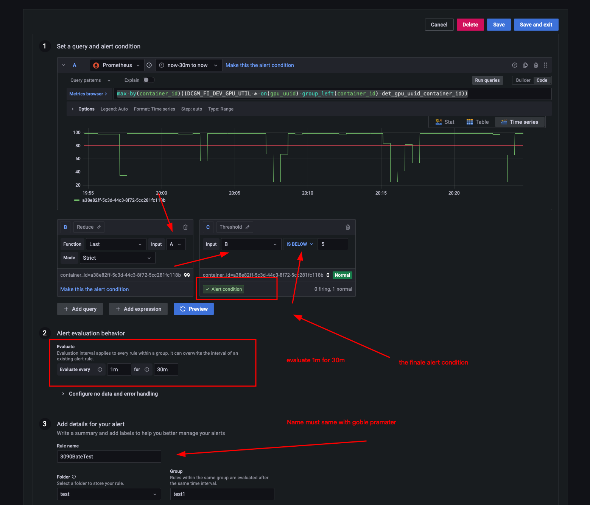

# Determined watchdog

Reclaims idle GPU shells on the Determined cluster and keeps the Determined API token that
Prometheus uses for the `det-master` scrape fresh. Runs as the `watchdog` service in
`services/docker-compose.yml` (image built from `build/`).

## What it does

Every hour, at minute 0 (`alert_min` in `build/alert_config.py`), it:

1. **Checks the Determined token** (see [Determined token](#determined-token-shared-with-prometheus)) and renews it if needed.
2. **Fetches the firing alerts** from Grafana's Alertmanager API
   (`/api/alertmanager/grafana/api/v2/alerts/?active=true&silenced=false&inhibited=false`).
   Silenced and inhibited alerts are ignored, so **a Grafana silence on
   `IdleKillAlert{container_id="..."}` exempts that container** from being killed.
3. If the alert named `GRAFANA_ALERT_NAME` is firing, maps its `container_id` labels to Determined
   **shells** (`/api/v1/shells/` + `/api/v1/tasks/`, allocation `<shell id>.1` -> `containerId`):
   - a shell that is idle for the first time gets a Slack **Warning**
     ("Your container will be released in 60 minutes");
   - a shell that was already warned at the previous check (at least 30 and at most 90 minutes
     earlier, `warning_min_age_minutes` / `warning_max_age_minutes`) and is still idle is killed
     (`POST /api/v1/shells/<id>/kill`).
     It is reported as **Terminated** only if the kill succeeded; a failed kill is logged, not
     reported, and retried at the next check.

Only shells are policed: idle commands, notebooks and trials are never killed.
If the alert is not firing, or no idle container belongs to a shell, it only logs.
Errors (Grafana/Determined/Slack unreachable, bad responses) are logged and the next hour tries
again; Slack delivery is best-effort and never stops the watchdog.
The warning state (`data/file_info.json` + `data/localData/`) survives restarts. A warning older
than 90 minutes (after downtime, or after an hour in which no shell was idle) is ignored and the
shell is warned again.

At start it runs the same token check once, **silently**: it only logs, so a restart or redeploy
posts nothing to Slack (details in [Determined token](#determined-token-shared-with-prometheus)).
If the watchdog starts during minute 0, the first hourly check follows immediately. If the
previous container already ran that hour's check, the new one skips it: a check that comes less
than 30 minutes (`warning_min_age_minutes`) after the previous saved one does nothing, so shells
warned seconds earlier still get the promised 60 minutes and are killed at the next hour. Starting
outside minute 0 (the deploy recipes below wait for hh:01) avoids even that skipped check.

### Slack messages

| Message | Sent by |
| --- | --- |
| **Warning** / **Terminated** with the shells' users | hourly check: idle shells warned / killed |
| `Automatic update success ~` | hourly check that renewed the Determined token; a renewal after HTTP 401 |
| `Automatic update FAILED ~ (<reason>)` | hourly check whose renewal failed (repeated every hour until it works); a failed renewal after HTTP 401 |
| `Failed to fetch Grafana alert! Reason: empty response.` | hourly check: Grafana unreachable or bad answer |
| `det api miss` / `need update api!` | hourly check: the Determined shell/task query failed |

The start-up token check posts none of these, whatever its outcome. A token check that keeps the
token posts nothing either, nor does a renewal whose new token has an expiry the watchdog cannot
decode (it is only logged, and renewed at every hourly check). In debug mode the alert check also
runs every ~20 s and everything goes to `SLACK_WEBHOOK_URL_DEBUG`. There is no weekly token
renewal any more: older versions logged in every Thursday (before PR #3 they also rewrote
`prometheus.yml` and restarted Prometheus) and posted `Automatic update success ~` each time; now
that message appears when an hourly check renews the token, roughly every 5 days.

## Grafana alert

<div align=center><br/><div>how to set on grafana</div> </div>

The alert rule (name = `GRAFANA_ALERT_NAME`, e.g. `IdleKillAlert`) must carry a `container_id` label.
The PromQL in A is:

```promql
max by(container_id)((DCGM_FI_DEV_GPU_UTIL * on(gpu_uuid) group_left(container_id) det_gpu_uuid_container_id))
```

The rule lives only in Grafana's database (it is not in this repo).

## Configuration

Create `.env` in this folder (it is gitignored; `chmod 600 .env`, it holds credentials):

```env
WATCHDOG_DEBUG=0
DET_WEB_URL=http://192.168.233.6:8080
DET_USERNAME=admin
DET_PASSWORD=<secret>
GRAFANA_WEB_URL=http://192.168.233.8:10080
GRAFANA_API_TOKEN=<secret>
GRAFANA_ALERT_NAME=IdleKillAlert
SLACK_WEBHOOK_URL=https://hooks.slack.com/services/<secret>/<secret>
SLACK_WEBHOOK_URL_DEBUG=https://hooks.slack.com/services/<secret>/<secret>
```

| Variable | Required | Meaning |
| --- | --- | --- |
| `WATCHDOG_DEBUG` | yes | `1`, `true`, `yes` or `on` (any case) = debug mode; anything else = production |
| `DET_WEB_URL` | yes | Determined master URL |
| `DET_USERNAME`, `DET_PASSWORD` | yes | Determined account used to log in (the token is also used by Prometheus) |
| `GRAFANA_WEB_URL`, `GRAFANA_API_TOKEN` | yes | Grafana URL and API (service account) token |
| `GRAFANA_ALERT_NAME` | yes | name of the idle-GPU alert rule |
| `SLACK_WEBHOOK_URL` | yes | Slack webhook used in production mode |
| `SLACK_WEBHOOK_URL_DEBUG` | yes | Slack webhook used in debug mode |
| `DETERMINED_METRICS_TOKEN_FILE` | no | token file in the container, default `/run/determined-metrics/token`; change it only together with the compose mounts and Prometheus' `credentials_file` |
| `DATA_DIR` | no | data directory, default `/app/data` |
| `DATA_DIR_DEBUG` | no | data directory in debug mode, default `/app/data/debug` |

`PORTAINER_WEB_URL`, `PORTAINER_API_TOKEN`, `PROMETHEUS_CONFIG_PATH` and `PROMETHEUS_WEB_URL` are no
longer used; they are ignored if still set (their names are logged at start) and can be deleted.

Secrets are never printed: the startup config dump shows `<redacted>` for the password, the Grafana
token and the Slack webhook, and the Determined token never appears in the logs.

## Determined token (shared with Prometheus)

[`../prometheus/README.md`](../prometheus/README.md#scrape-credential-migration) is the
authoritative description of this credential and of its one-time migration (revoke the token that
used to be tracked in `prometheus.yml`; it stays in Git history). In short:

- The host directory is `DET_METRICS_SECRETS_DIR` from `services/.env` (live:
  `/home/cvgladmin/.local/share/cluster-setup-monitoring/secrets`; default when unset or empty:
  `services/prometheus/secrets/`, ignored by the root `.gitignore`, so `git pull` does not create
  it; see [`../README.md`](../README.md#61-secrets-and-env-files)). It is mounted at
  `/run/determined-metrics`: read-write in the watchdog, read-only in Prometheus. The token file
  is `/run/determined-metrics/token` (on the host, `token` in that directory), used by the
  `det-master` job in `prometheus.yml`:

  ```yaml
  authorization:
    type: Bearer
    credentials_file: /run/determined-metrics/token
  ```

  Prometheus reads the file on every scrape, so a new token needs no YAML edit, reload or restart.
  The directory is mounted, not the file: a single-file bind mount would keep the old inode after
  the atomic replacement.
- Provision the configured directory once, before the stack starts, private to uid 1000 (the
  watchdog's `appuser` and Prometheus both run as 1000). From `services/`:

  ```sh
  d=$(sed -n 's/^DET_METRICS_SECRETS_DIR=//p' .env); sudo install -d -m 0700 -o 1000 -g 1000 "${d:-prometheus/secrets}"
  ```

  If it is missing when the stack starts, Docker creates it owned by root and the watchdog cannot
  write the token (the start-up check only logs `Determined token renewal FAILED (PermissionError
  ...)`; every hourly check then posts `Automatic update FAILED ~ (PermissionError ...)`); running
  the same `install -d` command fixes the owner and mode of an existing directory.
- The watchdog renews the token at start and at every hourly check when the file is missing or
  unreadable, when its expiry cannot be decoded, or when it expires in less than 48 hours
  (Determined sessions last 7 days, so this is roughly every 5 days). A restart does **not** log in
  again while the token is still valid.
- If Determined rejects the token before its expiry (e.g. the session was revoked), the watchdog
  renews it: at start and at every hourly check it sends the file token to `GET /api/v1/me`, and
  an HTTP 401 there triggers a new login (any other answer, or an unreachable master, keeps the
  token). This matters because a revoked token also breaks the `det-master` scrape, and with it
  the `GRAFANA_ALERT_NAME` alert (it needs `det_gpu_uuid_container_id`), so the watchdog would
  otherwise never query Determined and see the 401. When the alert does fire, an HTTP 401 on the
  watchdog's shell/task query also triggers one immediate login, a rewrite of the file and one
  retry of the query with the new session (also if the file cannot be written). Prometheus uses
  the new token at its next scrape. To recover at once instead of at the next hourly check:
  `docker compose restart watchdog` (the start-up check renews it without a Slack message; the log
  shows `Obtained new Determined token`; not during minute 0 of an hour, see
  [What it does](#what-it-does)).
- A login counts as successful only if it returns HTTP 2xx with JSON containing a non-empty `token`
  without whitespace. The file is written only by `build/metrics_token.py`
  (`write_metrics_token`: temp file in the same directory, fsync, rename; mode `0600`; the token
  followed by a newline).
- If the login fails, the old file is kept, a Slack warning ("Automatic update FAILED ~
  (<reason>)") is sent and the next hourly check retries. A successful renewal posts "Automatic
  update success ~". This holds for the hourly checks and for the renewals after an HTTP 401.
- **The start-up check is silent.** It keeps, renews or fails to renew the token by the same rules
  as an hourly check (including the `/api/v1/me` probe), but only logs: `Determined token OK`,
  `Obtained new Determined token`, or `Determined token renewal FAILED (...) ... [start-up check:
  not posted to Slack]`. So a restart or redeploy never posts "Automatic update success ~"; read
  `docker compose logs watchdog` instead. A failed start-up renewal is still pending (the file is
  still missing, expiring or rejected, or the write is still owed), so the next hourly check
  retries it and posts the outcome as usual; that check runs at minute 0, immediately if the
  watchdog started during minute 0.
- If the login works but the file cannot be written (disk full, directory owner or mode changed),
  the old file is kept and the same warning is sent (only logged at start), but the watchdog uses
  the new session for its own calls. The next hourly checks retry only the write, without logging
  in again (each failed retry sends the warning again; the successful one is only logged), unless
  that session itself needs renewal or the file was replaced by hand in the meantime (then the
  file's token is used).
- A token placed in the file by hand (see `../prometheus/README.md`) is kept while its expiry can
  be decoded and is more than 48 hours away; otherwise the watchdog replaces it at start with a
  session of `DET_USERNAME`.
- To force a new token, from `services/` (not during minute 0 of an hour, see
  [What it does](#what-it-does)):
  - the session was revoked and the `det-master` scrape is down, `.env` unchanged:
    `docker compose restart watchdog` (the start-up check gets HTTP 401 from `/api/v1/me` and
    logs in again, without a Slack message: check the log for `Obtained new Determined token`);
  - after editing `DET_USERNAME` or `DET_PASSWORD` in `determined-watchdog/.env` (a new token is
    wanted): move the current token aside instead of deleting it. Prometheus is still using it,
    and it can be put back if the new credentials do not work:

    ```sh
    cd ~/ws/cluster-setup/services
    d=$(sed -n 's/^DET_METRICS_SECRETS_DIR=//p' .env); d=${d:-prometheus/secrets}
    mv "$d/token" "$d/token.prev" && docker compose up -d watchdog
    sleep 30; docker compose logs watchdog | grep 'Determined token'
    ```

    Compose sees the changed `env_file` and recreates the container; its start-up check logs in
    again (only logged). If the log shows `Determined token renewal FAILED`, run
    `mv "$d/token.prev" "$d/token"` right away, so that Prometheus keeps the old, still valid
    token, and fix `.env`. Otherwise (`Obtained new Determined token`), run `rm "$d/token.prev"`.
    Restore `token.prev` only right after that `FAILED` line, never later: a later hourly check
    may already have written a new token. If only `Renewing the Determined token: ...` is shown
    yet (a login can take up to 70 s to time out), run the last line again a minute later.
  - after editing any other variable in `determined-watchdog/.env`: only
    `docker compose up -d watchdog`. Compose recreates the container because the `env_file`
    changed (`--force-recreate` also works); the token file stays.

  A plain restart keeps the container's old environment, as for frp
  ([`../README.md`](../README.md#61-secrets-and-env-files)).

## Data directory (`./data` -> `/app/data`)

- `User.json`: maps Determined usernames to Slack member IDs, used for @-mentions (users that are
  missing get their plain username):

  ```json
  {"<determined username>": {"UID": "<Slack member ID>", "slack_id": "<slack name>"}}
  ```
- `file_info.json`: points to the last saved warning list; kept across restarts, re-created only if
  missing or invalid.
- `localData/YYYY-MM/YYYY-MM-DD/localData_<timestamp>.json`: the shells warned at each check
  (plus shells whose kill failed).
- `debug/`: the same layout, used in debug mode.
- The directories themselves (`data/`, `data/localData/`, and `data/debug/` in debug mode) must be
  writable by uid 1000 (the container user): `file_info.json` and the records are written to a temp
  file in the same directory and then renamed, so a writable `file_info.json` alone is not enough.
  Otherwise the hourly check logs a `PermissionError` after warning, `file_info.json` never advances,
  and idle shells are warned every hour but never killed. Fix:
  `sudo chown -R 1000:1000 ~/ws/cluster-setup/services/determined-watchdog/data`.

## Debug mode

With `WATCHDOG_DEBUG=1` the watchdog uses `DATA_DIR_DEBUG` and `SLACK_WEBHOOK_URL_DEBUG`, does not
@-mention users, runs the alert check every ~20 s in addition to the hourly one, and never kills
anything: instead of `POST .../kill` it only `GET`s the shell and reports it as "Terminated".
The 30-minute minimum between a warning and its kill (`warning_min_age_minutes`) does not apply in
debug mode, so the dry-run "Terminated" follows at the next check, ~20 s after the warning.
Put a `User.json` into `data/debug/` first (the check fails without it).

## Deploy / update

The one-time update of `cvglsuppvm` from the hand-deployed state of 2026-09-28 (PR #4's image
`determined-watchdog:metrics-20260928`, checkout at `f71d24c` with local changes) is
[step by step in `../README.md`](../README.md#update-from-the-hand-deployed-state-of-2026-09-28);
its step 9 is the watchdog part. For later updates of the watchdog, from `services/` (it needs
`.env`, see [6.1](../README.md#61-secrets-and-env-files); if the same update changes other
services, apply those too, see [6](../README.md#6-all-in-one-services-except-harbor-and-node-exporter)):

```sh
cd ~/ws/cluster-setup/services
git status --porcelain                            # must print nothing: never commit or stash on the server
git fetch origin && git merge --ff-only origin/main
docker compose config -q && echo compose-ok       # must print compose-ok (fails without .env: PROMETHEUS_TSDB_DIR)
grep -iE '^WATCHDOG_DEBUG=' determined-watchdog/.env  # must be 0 (production) or 1 (debug), see below
stat -c '%u:%g %a %n' determined-watchdog/data determined-watchdog/data/localData  # 1000:1000, see Data directory
docker tag "$(docker inspect -f '{{.Image}}' services-watchdog-1)" determined-watchdog:previous  # rollback copy
docker compose build watchdog                     # a plain 'up -d' does not rebuild the watchdog image
[ "$(date +%M)" != 00 ] || sleep 60               # never (re)start it during minute 0 of an hour, see What it does
docker compose up -d watchdog
sleep 30; docker compose logs watchdog | grep -E 'Determined token|is_debug|base_path'
```

The last command must show `is_debug: False`, `base_path: /app/data` and `Determined token OK (expires
at ...)` or `Obtained new Determined token`. The start-up check is silent, so an update posts
nothing to Slack. The token file is `token` in `DET_METRICS_SECRETS_DIR` from `services/.env`
(live: `/home/cvgladmin/.local/share/cluster-setup-monitoring/secrets`; default
`prometheus/secrets/`); it must be owned by uid 1000 with mode `0600`, in a directory with mode
`0700`. Rollback (not during minute 0 of an hour either):
`docker tag determined-watchdog:previous determined-watchdog:latest && docker compose up -d --no-build --force-recreate watchdog`.

If the same update changed `prometheus/prometheus.yml` or `prometheus/rules/`, check them before
Prometheus loads them (as required by
[`../prometheus/README.md`](../prometheus/README.md#focused-validation-and-rollout)):

```sh
cd ~/ws/cluster-setup/services
docker compose run --rm --no-deps --user 1000:1000 --entrypoint promtool prometheus check config /etc/prometheus/prometheus.yml   # must print SUCCESS
```

The check runs with the service's own mounts. It needs `--user 1000:1000` (also the service's
user): the image's default user cannot enter the 0700 token directory, so "permission denied"
there is not a configuration error (never loosen the directory mode). It fails with "no such
file or directory" until the watchdog has written the token. Then recreate Prometheus
(`docker compose up -d --force-recreate prometheus`) and check that the `det-master` target is UP,
as in step 10 of [the update](../README.md#update-from-the-hand-deployed-state-of-2026-09-28).

Older versions treated only `WATCHDOG_DEBUG=1` as debug mode; `true`, `yes` and `on` now enable it
too (no kills, debug webhook). Set any value other than `0` or `1` to `0` before `up -d watchdog`.

The `PORTAINER_*` and `PROMETHEUS_*` lines in `determined-watchdog/.env` are ignored. Delete them
only when a rollback to `determined-watchdog:metrics-20260928` (PR #4) is no longer wanted: that
image exits at start without `PORTAINER_WEB_URL` and `PORTAINER_API_TOKEN`.

## Tests

Unit tests (stdlib `unittest`, need `requests`) live in `tests/` and are not part of the image;
neither are the two tests in `build/`: `test_metrics_token.py`, the regression test of the token
writer (stdlib only), and `test_startup_refresh.py`, the silent start-up check (start-up success
and failure post nothing, hourly renewals notify, no duplicate right after start, a failed
start-up renewal is retried and notified by the next hourly check; needs `requests`). From
`services/`:

```sh
docker compose build watchdog   # or: docker build -t determined-watchdog determined-watchdog/build
docker run --rm -v "$PWD/determined-watchdog:/w:ro" -w /tmp determined-watchdog \
    python -m unittest discover -s /w/tests
docker run --rm -v "$PWD/determined-watchdog:/w:ro" -w /w/build determined-watchdog \
    python -B -m unittest test_startup_refresh.py test_metrics_token.py
(cd determined-watchdog/build && python3 -B -m unittest test_metrics_token.py)  # stdlib only
```

or, with `requests` installed locally: `python3 -B -m unittest discover -s determined-watchdog/tests`
and `(cd determined-watchdog/build && python3 -B -m unittest test_startup_refresh.py)`.
