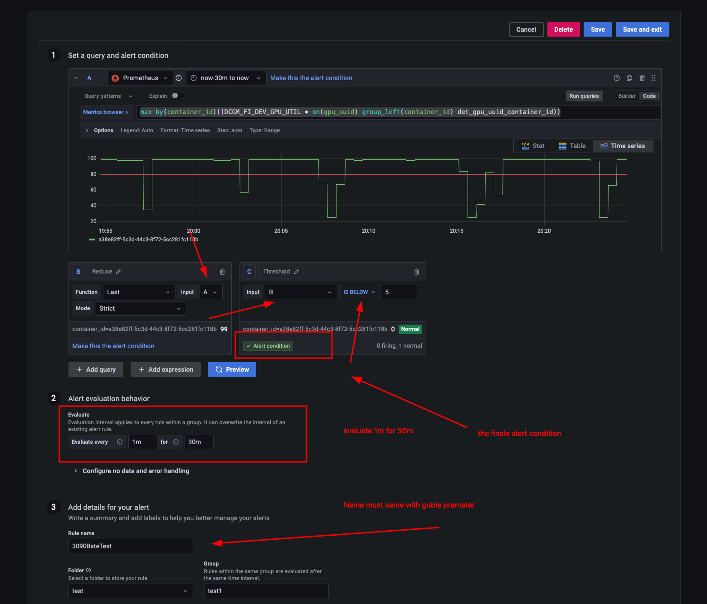

# config on grafana

<div align=center><br/><div>how to set on grafana</div> </div>

the PromQL in A is:

```lua
max by(container_id)((DCGM_FI_DEV_GPU_UTIL \* on(gpu_uuid) group_left(container_id) det_gpu_uuid_container_id))
```

# the gobel parameter you need know

```python
BateAlertKill = '3090BateTest'  # the name of the alert on the grafana
BateAlertWarning = '3090Warning'
GPU3090_KILL="3090BateTest"
IDLEWARNING="IdleWarning"
DEBUG = False  # 设置调试开关，True为开，False为关
# path
BASE_PATH = "/home/linsadmin/lins_services/services/supplementary/grafana/alterModel/data/"
# grafana
GRAFANA_API= 'https://grafana.lins.lab/api/alerts/'
ALERTGPU = 'GPU_KILL'
if DEBUG == False:
    BASE_PATH = "/home/linsadmin/lins_services/services/supplementary/grafana/alterModel/data/"
elif DEBUG == True:
    BASE_PATH = "/home/linsadmin/lins_services/services/supplementary/grafana/alterModel/TEST_DATA/"

# alert type
ALERT_TYPE = [GPU3090_KILL, IDLEWARNING]
# token  need update before can not use
GRAFANA_API_TOKEN = '<TBA YOUR GRAFANA TOKEN>'
GRAFANA_HEADERS ={
    'Authorization': f'Bearer {GRAFANA_API_TOKEN}'
}
```

# main function

```python
if __name__ == '__main__':
    initialize_file_info(ALERT_TYPE, SUB_ITEM, BASE_PATH, FILE_INFO_NAME)
    #start it when begin
    current_time = datetime.now()

    set_min = 16 # enable every hour 16min
    print("start")
    while True:
        now_time = datetime.now()
        if now_time.minute == set_min and TIMEFUNCITION_ENABLED_3090:
            TIMEFUNCITION_ENABLED_3090 = False
            # 执行函数操作
            # get alert form apu
            grafana_alert=get_alert_rules()
            if grafana_alert is None:
                self.message_notifier.send_slack_warning(
                    warning_type="ERROR",
                    info="Failed to fetch Grafana alert! Reason: empty response.",
                    slack_webhook_url=self.config.slack_webhook_url,
                )
                continue
            alert_total= get_container_ids_by_alertname(grafana_alert)
            # alert excute func
            handle_alert_data_v3(alert_total)

            # 将标识位设置为 True，表示函数已执行
        elif now_time.minute == set_min and TIMEFUNCITION_ENABLED_3090 is  False:
            pass
        elif now_time.minute != set_min:
            # 将标识位设置为 False，以便在下一个 20 分钟时重新执行函数
            TIMEFUNCITION_ENABLED_3090 = True
        else:
            pass
        if DEBUG is True:
            print("DEBUG TEST:")
            grafana_alert=get_alert_rules()
            print("grafana_alert")
            print(grafana_alert)
            alert_total= get_container_ids_by_alertname(grafana_alert)
            print("alert_total")
            print(alert_total)
            handle_alert_data_v3(alert_total)
            time.sleep(10)

        # print(".......................")
        print(now_time.minute,set_min)
        # print(set_min)
        time.sleep(10)
```

# token needed update

## def get_api_data(): det api

```python
def get_api_data():
    headers = {
        'Authorization': 'Bearer v2.public.<TBA YOUR DETERMINEDAI TOKEN>'}
```

---

```python
def kill_container(shell_id,debug):
    headers = {
        'Authorization': 'Bearer v2.public.<TBA YOUR DETERMINEDAI TOKEN>'}
```

## def get_api_data(): grafana api

```python
GRAFANA_API_TOKEN = '<TBA YOUR GRAFANA TOKEN>'
GRAFANA_HEADERS ={
    'Authorization': f'Bearer {GRAFANA_API_TOKEN}'
}
```

# design your onw message

```python
def send_slack_notification(new_data, container_ids_to_kill, user_info, DEBUG):
if DEBUG is True:
    slack_webhook_url = "<TBA YOUR WEBHOOK>"  # my test
elif DEBUG is False:
    slack_webhook_url = "<TBA YOUR WEBHOOK>"  # real slack!!!!

attachments = []
fields=[]
blocks = []
for container_id,info in new_data.items():
    username = info['username']
    print(username)
    user = user_info.get(username)  # Use the modified user_info
    if user is not None:
        slack_id = user['UID']
        if DEBUG is False:
            mention = f"<@{slack_id}>"
        elif DEBUG is True:
            mention = "<@<TBA SYSADMIN's slack_id>>"
    else:
        mention = username
    description = info.get('description', '')  # Get the description field
    field = {
        "value": f"{mention}",
        "title": f"{description}\n",  # Modify the title to use the description field
        "short": True
    }
    fields.append(field)
color = "warning"
footer = "Your container will be released in 60 minutes. Please check your task!!!"

attachment = {
    "fallback":f"Warning",
    "color": color,
    "title": f"Warning",
    "fields": fields,
    "footer": footer
}
attachments.append(attachment)


fields = []
for container_id, info in container_ids_to_kill.items():
    username = info['username']
    user = user_info.get(username)  # Use the modified user_info
    if user is not None:
        slack_id = user['UID']
        if DEBUG is False:
            mention = f"<@{slack_id}>"
        elif DEBUG is True:
            mention = "<@<TBA SYSADMIN's slack_id>>"
    else:
    mention = username
    description = info.get('description', '')  # Get the description field
    field = {
        "value": f"{mention}",
        "title": f"{description}\n",  # Modify the title to use the description field
        "short": True
    }
    fields.append(field)


color = "good"
footer = "These GPU containers have been released"

block = {
    "fallback": f"Terminated",
    "color": color,
    "title": f"Terminated",
    "fields": fields,
    "footer": footer
}

attachments.append(block)

data = {
    "attachments": attachments,
    "blocks": blocks
}

response = requests.post(
    slack_webhook_url,
    data=json.dumps(data),
    headers={'Content-Type': 'application/json'}
)

if response.status_code != 200:
    raise ValueError(
        'Request to Slack returned an error %s, the response is:\n%s'
        % (response.status_code, response.text)
    )
```
