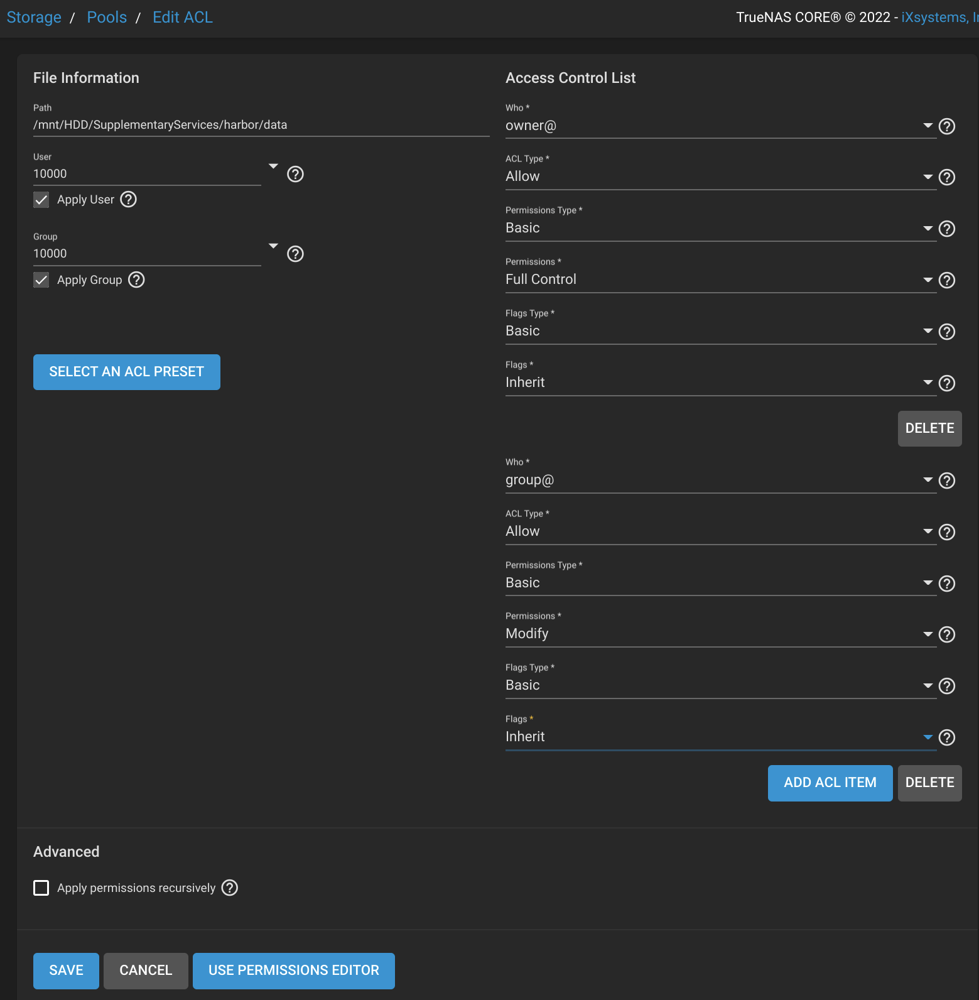
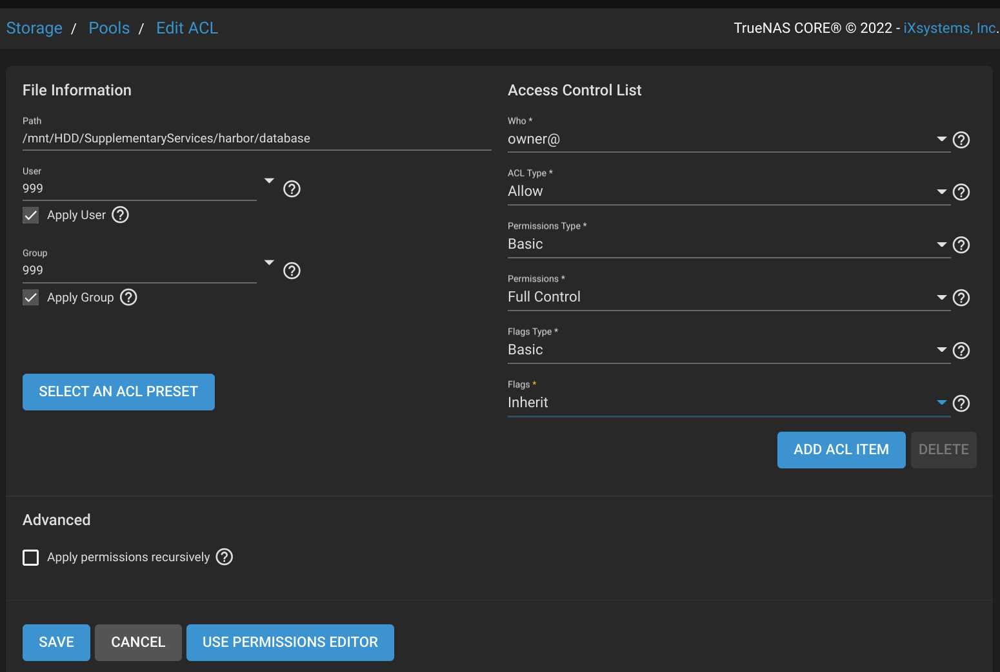
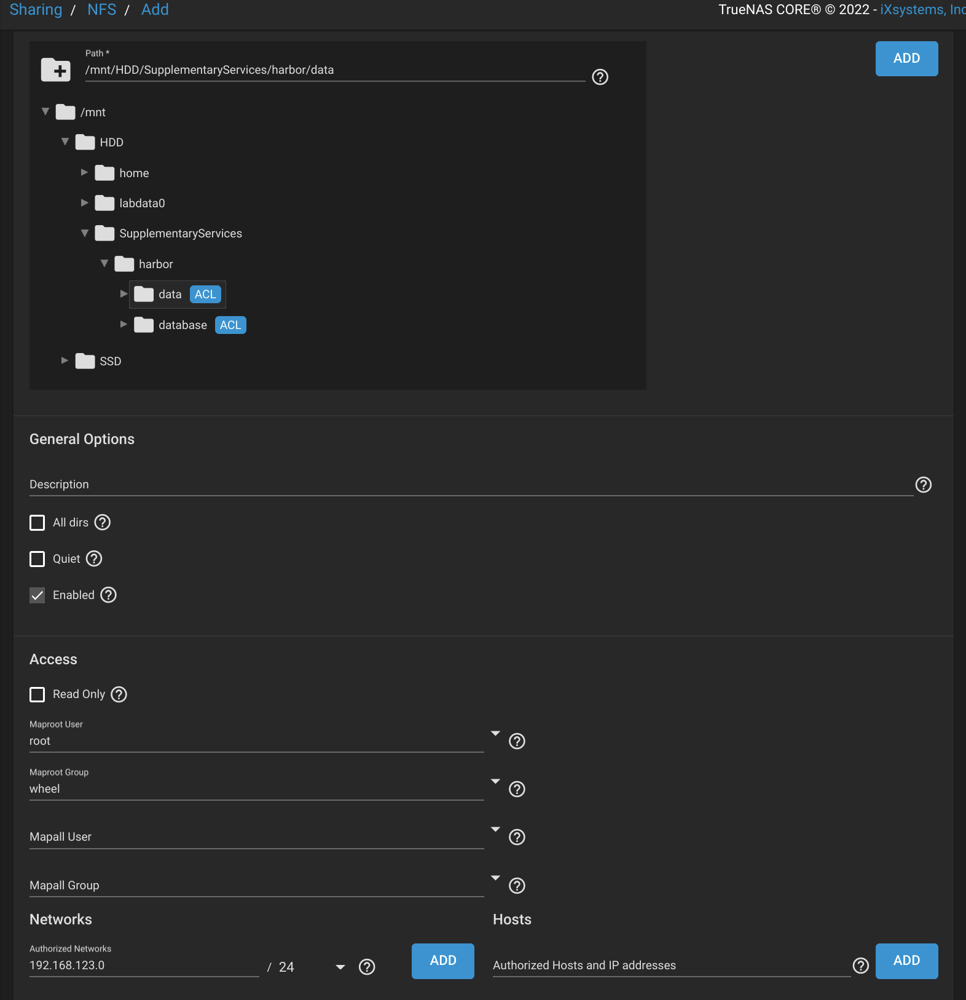
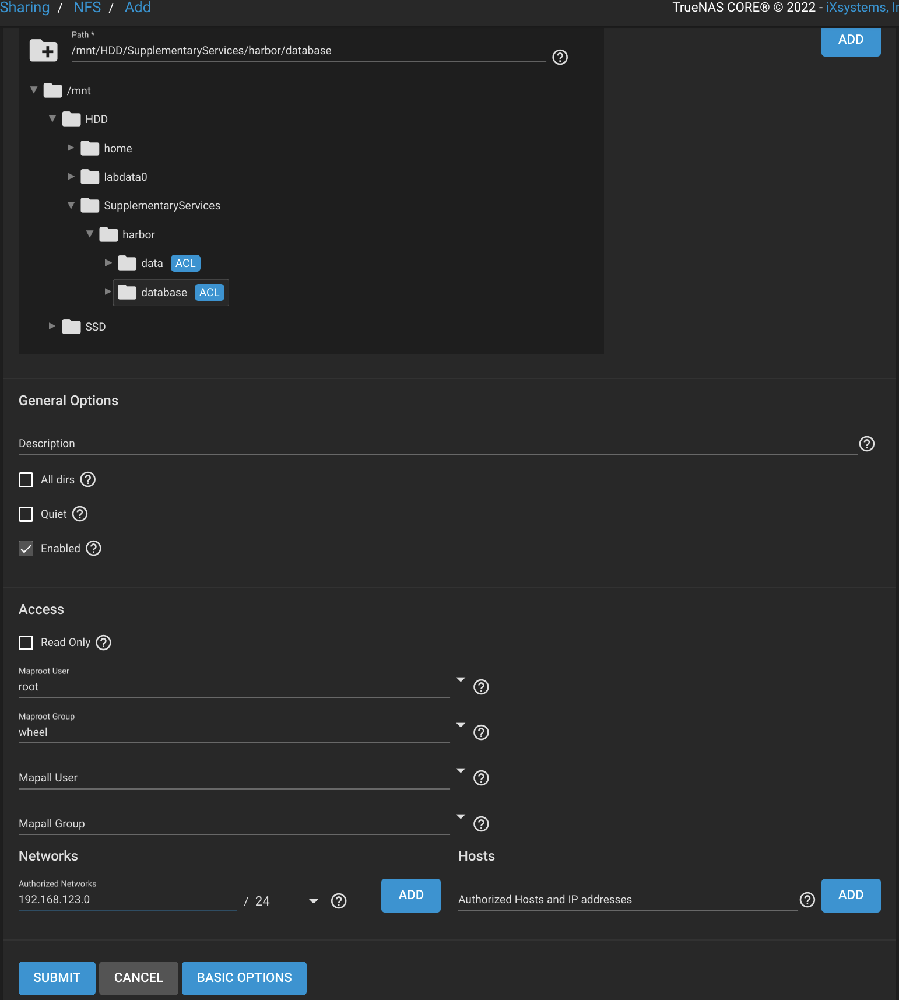
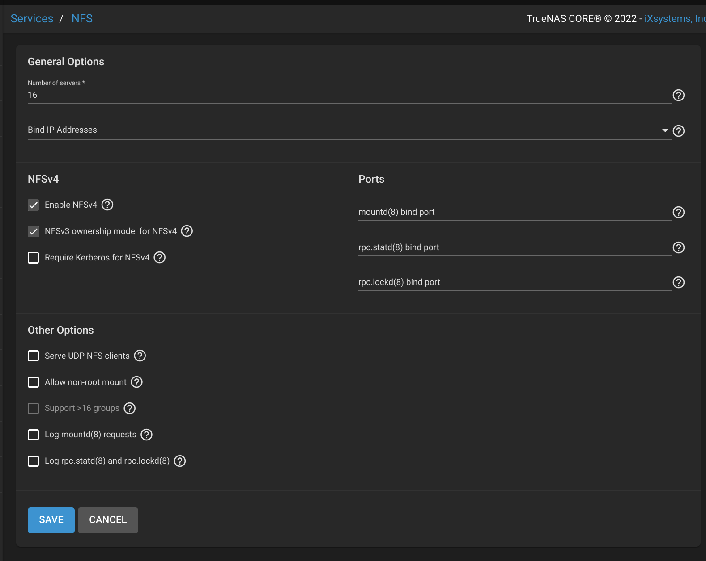

# Harbor

## Steps

- First download Harbor's [installer](https://github.com/goharbor/harbor/releases)
- Edit `harbor.yaml`, update `hostname`, `http.port`, `external_url`, `data_volume`, `log.location`
- Run `sudo install.sh`
- Run `docker-compose down`
- Edit `docker-compose.yml`, update PostgreSQL database volume path
- Run `docker-compose up -d`

## Notes

When using NFS storage:

- Move PostgreSQL's `database` folder outside of `data` to set separate ACL
- Set ACL `10000:10000` for `data` & `999:999` for `database`
- In NFS share configuration, enable map-root
- Use NFSv3 for the `database` (to avoid stale file handle)

Edit ACL for data:


Edit ACL for database:


Create NFS share for data:


Create NFS share for database:


Set up both NFSv4 and v3 compatablity:


Example of `/etc/fstab`:

```text
nas.cvgl.lab:/mnt/HDD/SupplementaryServices/harbor/data       /srv/nfs/var/harbor/data        nfs vers=4,rw,hard,intr,rsize=8192,wsize=8192,timeo=14,_netdev 0 0

nas.cvgl.lab:/mnt/HDD/SupplementaryServices/harbor/database   /srv/nfs/var/harbor/database    nfs vers=3,rw,hard,intr,rsize=8192,wsize=8192,timeo=14,_netdev 0 0
```

## Provided configuration and patch

You can use the provided `harbor.yml` and the patch file `harbor-nfs.diff` to install [Harbor](https://github.com/goharbor/harbor/releases/tag/v2.7.0) and switch to NFS:

```bash
tar -xvzf /path/to/harbor-offline-installer-v2.7.0.tgz    # tested version
mv harbor installer && cd installer
sudo bash ./install.sh
sudo docker compose down
sudo patch docker-compose.yml ../harbor-nfs.diff
sudo docker compose up -d
```
